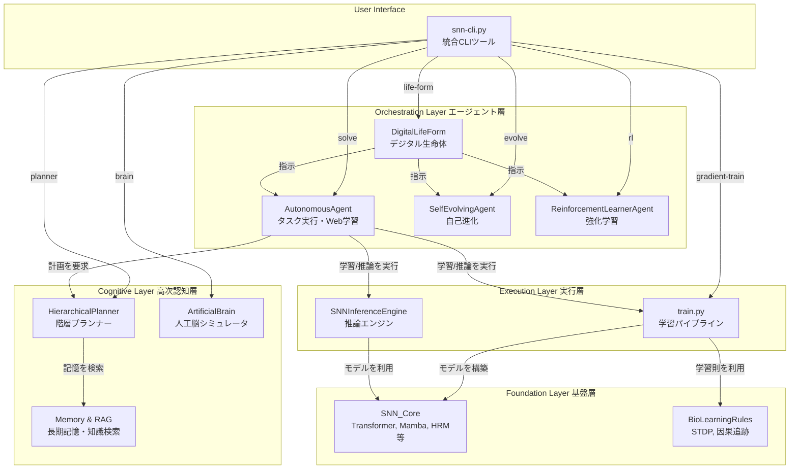

# **Project SNN: 自己進化するデジタル生命体の構築**

## **1\. 思想：予測する存在としてのAI**

本プロジェクトは、スパイキングニューラルネットワーク（SNN）技術を基盤とし、**自律的デジタル生命体 (Autonomous Digital Life Form)** の創造を目指す、次世代のAI研究開発フレームワークです。

我々のビジョンは、静的なパターン認識の限界を超え、世界の動的なモデルを内的に構築することにあります。その根本原理は**予測符号化**、すなわち\*\*「未来を予測し、その予測誤差を最小化する」\*\*という自己の存在理由に基づき、自律的に思考し、学習し、さらには自らのアーキテクチャや学習戦略さえも進化させるAIの実現です。

これは単なるチャットボットではありません。脳に着想を得た認知アーキテクチャを通じて、より汎用的で、エネルギー効率が高く、そして真に自律的な知性の形を追求する試みです。

## **2\. 主な特徴**

* **🧠 脳型認知アーキテクチャ:** 個別のAIモデルを「人工脳」として統合し、知覚、記憶、情動、意思決定、行動までの一貫した認知サイクルをシミュレートします。  
* **🚀 最先端SNNモデル群:** Spiking Transformer, Spiking Mamba, Spiking-HRMなど、複数の先進的SNNアーキテクチャを実装。タスクに応じて最適なモデルを選択・生成します。  
* **📚 オンデマンド学習と知識蒸留:** 未知のタスクに直面した際、Web検索でリアルタイムに情報を収集したり、大規模言語モデルから知識を蒸留したりして、タスク特化型の超省エネルギーな「専門家SNN」を自律的に生成します。  
* **🧬 自己進化するアーキテクチャ:** 自身の性能をメタ認知的に評価し、能力不足と判断した場合、モデルの層数や次元数、さらには**学習パラダイム自体**をも自律的に修正し、より強力なアーキテクチャへと進化します。  
* **🗺️ 推論ベースの計画立案:** 階層的プランナーが複雑なタスクをサブタスクに分解。自己の記憶と知識グラフ（RAG）を参照し、最適な実行計画を動的に推論します。  
* **🕹️ 生物学的強化学習:** 誤差逆伝播に依存しない生物学的な学習則（報酬変調型STDP、因果追跡）を用い、環境との試行錯誤から直接スキルを学習します。  
* **🔧 統合CLIツール (snn-cli.py):** 学習、推論、自己進化、人工脳シミュレーションまで、プロジェクトの全機能を単一のインターフェースから制御可能です。

## **3\. システムアーキテクチャ**

本システムは、ユーザーのコマンドを起点に、エージェント層が認知・実行層をオーケストレーションする階層構造になっています。

[a futuristic brain-computer interface diagramの画像](https://encrypted-tbn2.gstatic.com/licensed-image?q=tbn:ANd9GcTt92IEEquUiQtvr3obBB04xafmi43JxXCoNuXk9KslzBSAIQFpqz_q75BvAhaq0pegjnSQcb6R921Z1RI_De5wrnfOLp0rKlwyoT4RtJgNKZZDDqg)

## **4\. システムの実行方法**

### **ステップ1: 環境設定**

まず、必要なPythonライブラリをインストールします。

pip install \-r requirements.txt

### **ステップ2: システム健全性チェック（推奨）**

プロジェクト全体のユニットテストおよび統合テストを実行し、すべてのコンポーネントが正しく動作することを確認します。

pytest \-v

### **ステップ3: クイックスタート \- オンデマンド学習と推論（数分で完了）**

**目的:** システム全体（オンデマンド学習〜推論）のパイプラインが正常に完了することを確認します。

python snn-cli.py agent solve \\  
    \--task "高速テスト" \\  
    \--prompt "これはテストです。" \\  
    \--unlabeled-data data/sample\_data.jsonl \\  
    \--force-retrain

**Note:** このテストはあくまでシステムの動作確認用です。**使用するデータが非常に小さいため、AIは意味のある応答を生成できません。** 応答が空になるのは、学習データ不足による正常な動作です。

### **ステップ4: 本格実行 \- 大規模学習と対話**

**目的:** 大規模データセットでAIを本格的に学習させ、意味のある応答を生成できるようにします。

#### **ステップ4-1: 大規模データセットの準備（初回のみ）**

wikitext-103（100万行以上のテキスト）をダウンロードし、学習用に整形します。

python scripts/data\_preparation.py

#### **ステップ4-2: 本格的な学習の実行**

**A) 推奨：最強エンジン（Ultraモデル）の学習**

以下のコマンド一つで、データ準備から最大規模のSpiking Transformerモデルの学習までを自動的に実行します。これがプロジェクトの性能を最大限に引き出すための推奨プロセスです。

python snn-cli.py train-ultra \--override\_config "training.epochs=50"

**B) 通常モデルの学習**

特定のモデル構成で学習させたい場合は、従来通りagent solveコマンドを使用します。

python snn-cli.py agent solve \\  
    \--task "汎用言語モデル" \\  
    \--force-retrain

**Note:** これらの学習はマシンスペックにより数時間以上かかる可能性があります。

#### **ステップ4-3: 学習済みモデルとの対話**

学習済みのモデルを呼び出して対話します。--model\_configで使用したいモデルの設定ファイルを指定してください。

**A) 最強エンジン（Ultraモデル）との対話**

python snn-cli.py ui start \--model\_config configs/models/ultra.yaml

**B) 通常モデルとの対話**

python snn-cli.py agent solve \\  
    \--task "汎用言語モデル" \\  
    \--prompt "SNNとは何ですか？"

### **ステップ5: 高度な機能の探求**

その他の高度な機能（Webからの自律学習、自己進化、強化学習など）については、doc/SNN開発：プロジェクト機能テスト コマンド一覧.md をご参照ください。

## **5\. プロジェクト構造**

snn4/  
├── app/                  \# UIアプリケーションとDIコンテナ  
├── configs/              \# 設定ファイル (base, models/\*.yaml)  
├── data/                 \# 学習用データセット  
├── doc/                  \# ドキュメント  
├── runs/                 \# (自動生成) 学習ログ、チェックポイント、モデル登録簿  
├── scripts/              \# データ準備やベンチマークなどの補助スクリプト  
├── snn\_research/         \# SNNコア研究開発コード  
│   ├── agent/            \# 各種エージェント (自律、自己進化、生命体、強化学習)  
│   ├── benchmark/        \# SNN vs ANN 性能評価  
│   ├── cognitive\_architecture/ \# 高次認知機能 (プランナー、人工脳など)  
│   ├── communication/    \# エージェント間通信  
│   ├── conversion/       \# ANN-SNNモデル変換  
│   ├── core/             \# SNNモデル (BreakthroughSNN, SpikingTransformer, Mamba, HRM)  
│   ├── data/             \# データセット定義  
│   ├── deployment.py     \# 推論エンジン  
│   ├── distillation/     \# 知識蒸留とモデル登録簿  
│   ├── hardware/         \# ニューロモーフィックハードウェア関連  
│   ├── io/               \# 感覚入力・運動出力  
│   ├── learning\_rules/   \# 生物学的学習則 (STDPなど)  
│   ├── metrics/          \# 評価指標  
│   ├── models/           \# (旧) モデルアーキテクチャ  
│   ├── rl\_env/           \# 強化学習環境  
│   ├── tools/            \# 外部ツール (Webクローラーなど)  
│   └── training/         \# Trainerと損失関数  
├── tests/                \# テストコード  
├── snn-cli.py            \# ✨ 統合CLIツール  
├── train.py              \# 勾配ベース学習の実行スクリプト (CLIから呼び出される)  
├── run\_\*.py              \# 各機能の実行スクリプト  
└── requirements.txt      \# 必要なライブラリ  
