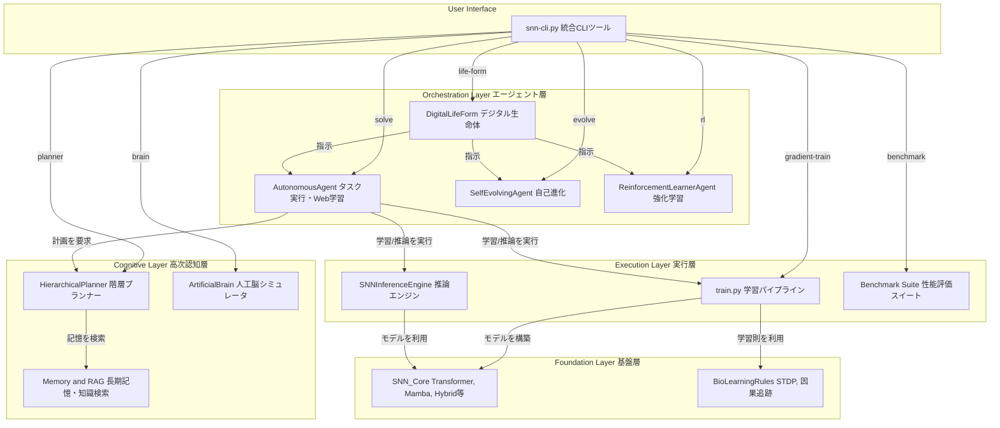

# **Project SNN: 自己進化するデジタル生命体の構築**

## **1\. 思想：予測する存在としてのAI**

本プロジェクトは、スパイキングニューラルネットワーク（SNN）技術を基盤とし、**自律的デジタル生命体 (Autonomous Digital Life Form)** の創造を目指す、次世代のAI研究開発フレームワークです。

我々のビジョンは、静的なパターン認識の限界を超え、世界の動的なモデルを内的に構築することにあります。その根本原理は**予測符号化**、すなわち\*\*「未来を予測し、その予測誤差を最小化する」\*\*という自己の存在理由に基づき、自律的に思考し、学習し、さらには自らのアーキテクチャや学習戦略さえも進化させるAIの実現です。

これは単なるチャットボットではありません。脳に着想を得た認知アーキテクチャを通じて、より汎用的で、エネルギー効率が高く、そして真に自律的な知性の形を追求する試みです。

## **2\. 主な特徴**

* **🧠 脳型認知アーキテクチャ:** 知覚、記憶、情動、意思決定、行動までの一貫した認知サイクルをシミュレートする「人工脳」を実装しています。  
* **🚀 最先端SNNモデル群:** Spiking Transformer, Spiking Mamba, SpikingCNNなど、複数の先進的SNNアーキテクチャを実装。タスクに応じて最適なモデルを選択・生成します。  
* **📚 オンデマンド学習と知識蒸留:** 未知のタスクに直面した際、Web検索や大規模言語モデルからの知識蒸留により、タスク特化型の超省エネルギーな「専門家SNN」を自律的に生成します。  
* **🧬 自己進化するアーキテクチャ:** 自身の性能をメタ認知的に評価し、モデルの層数や次元数、さらには**学習パラダイム自体**をも自律的に修正し、より強力なアーキテクチャへと進化します。  
* **📊 ANN vs SNN 統合ベンチマーク:** 統一された環境でANNとSNNの性能（精度、速度、エネルギー効率）を直接比較し、結果をリーダーボード形式で自動的に追記・管理します。  
* **🔧 統合CLIツール (snn-cli.py):** 学習、推論、自己進化、人工脳シミュレーションまで、プロジェクトの全機能を単一のインターフェースから制御可能です。

## **3\. システムアーキテクチャ**

本システムは、ユーザーのコマンドを起点に、エージェント層が認知・実行層をオーケストレーションする階層構造になっています。

## **4\. クイックスタート**

### **ステップ1: 環境設定**

まず、必要なPythonライブラリをインストールします。

pip install \-r requirements.txt

※Mac(Mシリーズ)環境ではPytorchバグ対策のためターミナルで下記を実行してください。
export PYTORCH_ENABLE_MPS_FALLBACK=1

### **ステップ2: システム健全性チェック**

プロジェクト全体のユニットテストおよび統合テストを実行し、すべてのコンポーネントが正しく動作することを確認します。

pytest \-v

### **ステップ3: 基本的な学習の実行**

統合CLIツール snn-cli.py を使って、最小構成のモデル (micro.yaml) で学習パイプラインが動作することを確認します。

python snn-cli.py gradient-train \\  
    \--model-config configs/models/micro.yaml \\  
    \--data-path data/smoke\_test\_data.jsonl \\  
    \--override\_config "training.epochs=3"

## **5\. 詳細な利用方法**

プロジェクトの全機能は snn-cli.py からアクセスできます。以下に主要なワークフローを示します。

### **5.1 基本的な学習と推論**

#### **学習**

gradient-train コマンドで、指定した設定に基づきSNNモデルを直接学習させます。

\# 中規模モデル(medium.yaml)を5エポック学習  
python snn-cli.py gradient-train \\  
    \--model-config configs/models/medium.yaml \\  
    \--data-path data/sample\_data.jsonl \\  
    \--override\_config "training.epochs=5"

学習ログとモデルのチェックポイントは runs/snn\_experiment ディレクトリ（または設定ファイルで指定した log\_dir）に保存されます。

#### **推論（対話UI）**

ui コマンドでGradioベースのWeb UIを起動し、学習済みモデルと対話します。

\# 先ほど学習したモデルを読み込んでUIを起動  
python snn-cli.py ui \--model-config configs/models/medium.yaml

### **5.2 高忠実度ANN-SNN変換**

本プロジェクトの最重要機能の一つです。既存の学習済みANN資産を活用し、高性能なSNNを生成します。

#### **A) CNNモデルの変換 (例: ResNet)**

画像認識で広く使われるCNN（畳み込みニューラルネットワーク）をSNNに変換します。このプロセスは、ANN-SNN変換における精度低下の主要因である\*\*バッチ正規化（BatchNorm）\*\*の問題を解決するため、**BatchNorm Folding**という重要なステップを内蔵しています。

**ワークフロー:**

1. **ANNモデルの学習（ユーザー側で実施）**  
   * PyTorchなどでSimpleCNN（snn\_research/benchmark/ann\_baseline.pyを参照）やResNetなどのモデルを学習させ、.pthファイルとして保存します。  
2. **高忠実度変換の実行**  
   * convert cnn-convert コマンドを使用し、学習済みANNモデルを指定します。このコマンドは内部で自動的にBatchNorm層を畳み込み層に統合し、安全な重みコピーと閾値キャリブレーションを実行します。

\# (例) 学習済みのann\_cnn.pthを、snnの設定(cifar10\_spikingcnn\_config.yaml)に基づき変換  
python snn-cli.py convert cnn-convert \\  
    \--ann-model-path path/to/your/ann\_cnn.pth \\  
    \--snn-model-config configs/cifar10\_spikingcnn\_config.yaml \\  
    \--output-snn-path runs/converted/spiking\_cnn.pth

#### **B) 大規模言語モデル(LLM)の変換 (実験的機能)**

TransformerベースのLLMをSNNに変換します。

**警告:** Transformerアーキテクチャ全体（特にSoftmaxやLayerNormを含む自己注意機構）を単純にスパイク化すると、深刻な性能低下を招く可能性があります。現実的なアプローチは、計算が複雑な部分をアナログのまま残す**ハイブリッドモデル**や、変換後に長時間の**代理勾配による微調整**を行うことです。

llm-convert コマンドは、この変換プロセスの第一歩として、互換性のある層（主に線形層）の重みを安全にコピーし、活性化分布に基づいた**閾値キャリブレーション**を実行します。

\# (例) Hugging Faceの 'gpt2' モデルを、SpikingTransformerの設定に基づき変換  
python snn-cli.py convert llm-convert \\  
    \--ann-model-path gpt2 \\  
    \--snn-model-config configs/models/spiking\_transformer.yaml \\  
    \--output-snn-path runs/converted/spiking\_gpt2.pth

### **5.3 自律エージェントと認知アーキテクチャ**

#### **オンデマンド学習**

agent solve コマンドで、エージェントに未知のタスクを与えます。エージェントは自律的にWebで情報を収集し、知識蒸留によってタスク特化型の専門家SNNを生成します。

\# 「最新のAI技術」についてWeb学習させ、専門家モデルを構築  
python snn-cli.py agent solve \\  
    \--task "最新のAI技術" \\  
    \--unlabeled-data-path data/sample\_data.jsonl \\  
    \--force-retrain

#### **自己進化**

agent evolve コマンドで、エージェントに自己評価と改善のサイクルを実行させます。エージェントは自身のアーキテクチャや学習パラメータ、さらには**学習パラダイム自体**を変更する提案を生成します。

python snn-cli.py agent evolve \\  
    \--task-description "高難度の文章分類" \\  
    \--model-config configs/models/small.yaml \\  
    \--training-config configs/base\_config.yaml

#### **人工脳シミュレーション**

brain コマンドで、統合された認知アーキテクチャ全体を動作させます。--loopフラグを付けると、対話形式でAIの「思考プロセス」を観察できます。

\# 対話形式で人工脳を起動  
python snn-cli.py brain \--loop

### **5.4 パフォーマンス評価**

benchmark run コマンドで、標準的なタスク（CIFAR-10, SST-2など）におけるSNNとANNの性能（精度、速度、エネルギー効率）を直接比較します。

\# CIFAR-10でSNNとANNの比較ベンチマークを1エポック実行  
python snn-cli.py benchmark run \\  
    \--experiment cifar10\_comparison \\  
    \--epochs 1  
