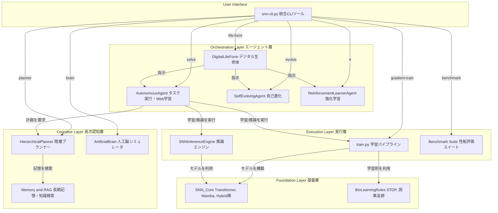

# **Project SNN: 自己進化するデジタル生命体の構築**

## **1\. 思想：予測する存在としてのAI**

本プロジェクトは、スパイキングニューラルネットワーク（SNN）技術を基盤とし、**自律的デジタル生命体 (Autonomous Digital Life Form)** の創造を目指す、次世代のAI研究開発フレームワークです。

我々のビジョンは、静的なパターン認識の限界を超え、世界の動的なモデルを内的に構築することにあります。その根本原理は**予測符号化**、すなわち\*\*「未来を予測し、その予測誤差を最小化する」\*\*という自己の存在理由に基づき、自律的に思考し、学習し、さらには自らのアーキテクチャや学習戦略さえも進化させるAIの実現です。

これは単なるチャットボットではありません。脳に着想を得た認知アーキテクチャを通じて、より汎用的で、エネルギー効率が高く、そして真に自律的な知性の形を追求する試みです。

## **2\. 主な特徴**

* **🧠 脳型認知アーキテクチャ:** 知覚、記憶、情動、意思決定、行動までの一貫した認知サイクルをシミュレートする「人工脳」を実装しています。  
* **🚀 最先端SNNモデル群:** Spiking Transformer, Spiking Mamba, SpikingCNNなど、複数の先進的SNNアーキテクチャを実装。タスクに応じて最適なモデルを選択・生成します。  
* **📚 オンデマンド学習と知識蒸留:** 未知のタスクに直面した際、Web検索や大規模言語モデルからの知識蒸留により、タスク特化型の超省エネルギーな「専門家SNN」を自律的に生成します。  
* **🧬 自己進化するアーキテクチャ:** 自身の性能をメタ認知的に評価し、モデルの層数や次元数、さらには**学習パラダイム自体**をも自律的に修正し、より強力なアーキテクチャへと進化します。  
* **📊 ANN vs SNN 統合ベンチマーク:** 統一された環境でANNとSNNの性能（精度、速度、エネルギー効率）を直接比較し、結果をリーダーボード形式で自動的に追記・管理します。  
* **🔧 統合CLIツール (snn-cli.py):** 学習、推論、自己進化、人工脳シミュレーションまで、プロジェクトの全機能を単一のインターフェースから制御可能です。

## **3\. システムアーキテクチャ**

本システムは、ユーザーのコマンドを起点に、エージェント層が認知・実行層をオーケストレーションする階層構造になっています。

## **4\. システムの実行方法**

### **ステップ1: 環境設定**

まず、必要なPythonライブラリをインストールします。

pip install \-r requirements.txt

### **ステップ2: システム健全性チェック（推奨）**

プロジェクト全体のユニットテストおよび統合テストを実行し、すべてのコンポーネントが正しく動作することを確認します。

pytest \-v

### **ステップ3: ANN vs SNN 性能比較**

snn\_4\_ann\_parity\_plan.mdに基づき、標準的なベンチマークでANNとSNNの性能を直接比較・評価します。

#### **ワークフロー1: 直接学習による性能比較**

**A) 画像分類タスク (CIFAR-10)**

snn-cli benchmark run \--experiment cifar10\_comparison \--epochs 5 \--tag "direct\_learning\_cnn"

**B) 自然言語処理タスク (SST-2 感情分析)**

snn-cli benchmark run \--experiment sst2\_comparison \--epochs 3 \--tag "direct\_learning\_transformer"

実験完了後、結果はbenchmarks/ディレクトリにリーダーボード形式で自動的に追記・保存されます。

#### **ワークフロー2: ANN-SNN変換による性能評価**

1. まず、ベースとなるANNモデルを訓練します。  
   (この例では、訓練済みのANNモデル ann\_model.pth が存在すると仮定します。)  
2. **次に、学習済みのANNの重みをSNNに変換します。**  
   snn-cli convert ann2snn-cnn ann\_model.pth converted\_snn\_model.pth

3. 最後に、変換されたSNNモデルの性能を評価します。  
   (このステップは、run\_benchmark\_suite.pyを改造して評価のみを行うモードを追加することで実現できます。)

### **ステップ4: 本格実行 \- 大規模学習と対話**

**目的:** 大規模データセットでAIを本格的に学習させ、意味のある応答を生成できるようにします。

#### **4-1: 大規模データセットの準備（初回のみ）**

python scripts/data\_preparation.py

#### **4-2: 本格的な学習の実行**

\# 推奨：最強エンジン（Ultraモデル）の学習  
snn-cli train-ultra \--override\_config "training.epochs=50"

#### **4-3: 学習済みモデルとの対話**

snn-cli ui start \--model\_config configs/models/ultra.yaml  
