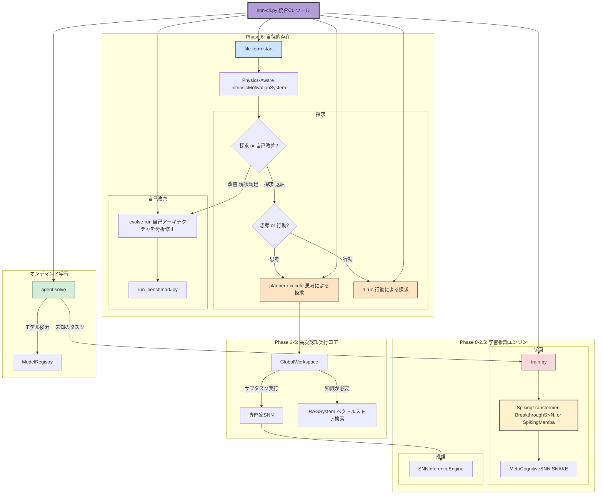

# **Project SNN: A Predictive Digital Life Form (v4.3)**

## **1\. 概要**

本プロジェクトは、スパイキングニューラルネットワーク（SNN）技術を基盤とし、**自律的デジタル生命体 (Autonomous Digital Life Form)** の創造を目指す研究開発フレームワークです。

最終目標は、静的なパターン認識の限界を超え、世界の動的なモデルを内的に構築し、**未来を予測し、その予測誤差を最小化する**という自己の存在理由に基づき、自律的に思考し、学習し、自己を改良するAIを実現することです。

このシステムは、単なるチャットボットではなく、以下の高度な認知能力を備えた自律エージェントとして動作します。

* **先進的なSNNアーキテクチャ:** 脳の働きに着想を得た**予測符号化モデル**、時間情報処理能力を最大化する**スパイキングトランスフォーマー**に加え、長文脈処理に革命をもたらす**スパイキングMAMBA**という、3つの最先端アーキテクチャをタスクに応じて切り替え可能です。
* **オンデマンド学習:** 未知のタスクに直面した際、大規模言語モデルから知識を蒸留し、タスクに特化した超省エネルギーな「専門家SNN」を自律的に生成します。
* **自己認識と計画立案:** 自身の能力（学習済み専門家モデル）を把握し、学習済みのプランナーSNNを用いて、複雑なタスクをサブタスクに分解し、最適な実行計画を動的に推論します。
* **アーキテクチャレベルの自己進化:** 自らの性能を評価し、表現力不足と判断した場合、自身のソースコード（モデルの層数や次元数）を自律的に修正し、より強力なアーキテクチャへと進化します。
* **行動を通じた学習（強化学習）:** バックプロパゲーションを使わない生物学的な学習則（報酬変調型STDP）を用い、環境との試行錯誤から直接スキルを学習する能力を持ちます。

## **2\. システムアーキテクチャ**

本システムの認知アーキテクチャは、複数の専門コンポーネントが階層的に連携することで実現されています。

本システムの認知アーキテクチャは、複数の専門コンポーネントが階層的に連携することで実現されています。

## **3\. システムの実行方法**

### **ステップ1: 環境設定**

まず、必要なPythonライブラリをインストールします。

pip install \-r requirements.txt

### **ステップ2: 統合CLIツール snn-cli.py の使い方**

本プロジェクトの全ての機能は、snn-cli.py という単一のコマンドから実行できます。

### **A) クイックスタート：迅速な機能テスト（数分で完了）**

**目的:** システム全体がエラーなく動作することを確認します。

python snn-cli.py agent solve \\  
    \--task "高速テスト" \\  
    \--prompt "これはテストです。" \\  
    \--unlabeled-data data/sample\_data.jsonl \\  
    \--force-retrain

**Note:** このテストはあくまでシステムの動作確認用です。**使用するデータが非常に小さいため、AIは意味のある応答を生成できません。** 応答が空になるのは、学習データ不足による正常な動作です。

### **B) 本格実行：SNNの能力を向上させるための学習と対話**

**目的:** 大規模データセットでAIを本格的に学習させ、意味のある応答を生成できるようにします。

#### **ステップB-1: 大規模データセットの準備（初回のみ）**

wikitext-103（100万行以上のテキスト）をダウンロードし、学習用に整形します。

python scripts/data\_preparation.py

#### **ステップB-2: 本格的な学習の実行**

準備した大規模データセットを使い、汎用的な言語能力を持つ専門家モデル「汎用言語モデル」を育成します。

python snn-cli.py agent solve \\  
    \--task "汎用言語モデル" \\  
    \--force-retrain

**Note:** この学習はマシンスペックにより数時間以上かかる可能性があります。

#### **ステップB-3: 学習済みモデルとの対話**

上記の本格的な学習で育成した「汎用言語モデル」を呼び出して対話します。

python snn-cli.py agent solve \\  
    \--task "汎用言語モデル" \\  
    \--prompt "SNNとは何ですか？"

### **C) その他の高度な機能**

その他の高度な機能（Webからの自律学習、自己進化、強化学習など）については、SNN開発：プロジェクト機能テスト コマンド一覧.md をご参照ください。

## **4\. プロジェクト構造**

snn4/  
├── app/                  \# UIアプリケーションとDIコンテナ  
├── configs/              \# 設定ファイル (base, models/\*.yaml)  
├── data/                 \# 学習用データセット  
├── doc/                  \# ドキュメント  
├── runs/                 \# (自動生成) 学習ログ、チェックポイント、モデル登録簿  
├── scripts/              \# データ準備やベンチマークなどの補助スクリプト  
├── snn\_research/         \# SNNコア研究開発コード  
│   ├── agent/            \# 各種エージェント (自律、自己進化、生命体、強化学習)  
│   ├── benchmark/        \# SNN vs ANN 性能評価  
│   ├── cognitive\_architecture/ \# 高次認知機能 (プランナー、物理評価器等)  
│   ├── core/             \# SNNモデル (BreakthroughSNN, SpikingTransformer)  
│   ├── data/             \# データセット定義  
│   ├── deployment.py     \# 推論エンジン  
│   ├── distillation/     \# 知識蒸留とモデル登録簿  
│   ├── learning\_rules/   \# 生物学的学習則 (STDPなど)  
│   ├── rl\_env/           \# 強化学習環境  
│   ├── tools/            \# 外部ツール (Webクローラーなど)  
│   └── training/         \# Trainerと損失関数  
├── snn-cli.py            \# ✨ 統合CLIツール  
├── train.py              \# 勾配ベース学習の実行スクリプト (CLIから呼び出される)  
├── run\_web\_learning.py   \# ✨ Webからの自律学習実行スクリプト  
└── requirements.txt      \# 必要なライブラリ  
